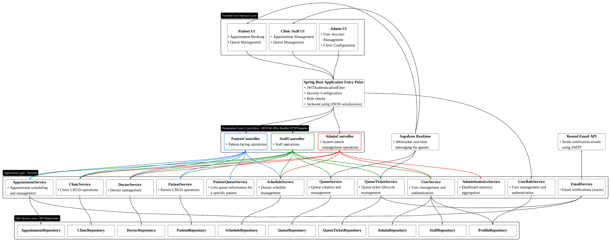

# Clinic Management System - System Design

## Overview

The Clinic Management System is a comprehensive web-based application designed to streamline clinic operations through appointment booking, queue management, and administrative functions. The system follows a layered architecture pattern with clear separation of concerns and role-based access control.

## Architecture Overview

The system adopts a **layered architecture** with a Spring Boot backend and Vue.js frontend, providing scalable and maintainable clinic management capabilities. The updated system architecture diagram (`system-architecture-diagram.png`) reflects the following structure.

### System Layers

#### 1. Frontend User Interface Layer
Three role-specific experiences deliver the clinic workflows:

- **Patient UI**  
  - Appointment booking  
  - Queue and ticket status tracking  
  
- **Clinic Staff UI**  
  - Appointment management and approvals  
  - Queue orchestration for on-site operations  
  
- **Admin UI**  
  - User account provisioning and oversight  
  - Clinic-wide configuration and policy management  
  
#### 2. Spring Boot Application Entry Point
Central application configuration that enforces security and prepares the REST layer:

- **JWTAuthenticationFilter**: Applies token validation to every protected endpoint  
- **Security Configuration**: Defines role-based access policies and password rules  
- **Role Checks**: Guards controller methods with fine-grained authorisation  
- **JacksonConfig**: Standardises JSON serialisation across services  
  
#### 3. Presentation Layer (Controllers)
REST controllers handle incoming HTTP requests and delegate to the application services:

- **PatientController**: Patient-facing appointment, queue, and ticket flows  
- **StaffController**: Staff tooling for managing clinic queues and schedules  
- **AdminController**: Administrative management of users, clinics, and reporting  
- **Auth endpoints** (within the entry point) expose login and token refresh capabilities  
  
#### 4. Application Layer (Services)
Domain services orchestrate business rules, validation, and transactional workflows:

- **AppointmentService**: Booking windows, validation, and lifecycle updates  
- **ClinicService**: CRUD operations for clinic locations and settings  
- **DoctorService**: Doctor roster management and availability  
- **PatientService**: Patient onboarding, profile, and appointment interactions  
- **PatientQueueService**: Queue aggregation for patient-specific views  
- **ScheduleService**: Doctor schedules, slot assignment, and adjustments  
- **QueueService**: Queue creation, routing, and state transitions  
- **QueueTicketService**: Ticket lifecycle, issuance, and hand-offs  
- **UserService**: Authentication, profile management, password resets  
- **AdminStatisticsService**: Dashboard metrics and historical reporting  
- **UserRoleService**: Role assignment and access management  
- **EmailService**: Asynchronous outbound notifications via external SMTP  
  
#### 5. Data Access Layer
Spring Data JPA repositories abstract persistence for the services:

- **AppointmentRepository**, **ClinicRepository**, **DoctorRepository**, **PatientRepository**  
- **ScheduleRepository**, **QueueRepository**, **QueueTicketRepository**  
- **AdminRepository**, **StaffRepository**, **ProfileRepository**  
- **User-related repositories** supporting authentication and authorisation flows  
  
#### 6. External Integrations

- **Supabase Realtime**: WebSocket-based messaging for instant queue updates between backend and clients  
- **Resend Email API**: Delegated SMTP delivery for patient and staff notification emails  
- **Supabase PostgreSQL**: Managed database hosting for transactional data  

## Key Features

### Real-time Capabilities
- **Supabase Realtime**: Streams queue status and ticket updates to subscribed clients
- **Live Updates**: Bidirectional communication keeps patient and staff views synchronised

### External Integrations
- **Resend Email API**: Automated transactional emails for bookings, reminders, and alerts
- **Supabase Integration**: Cloud-hosted PostgreSQL database with built-in security and realtime messaging
- **SMS API**: Optional text message notifications for critical updates

### Security Features
- JWT-based authentication with role-based authorization
- Secure API endpoints with proper access controls
- User session management and validation

### Multi-Role Support
The system supports three distinct user roles:
1. **Patients**: Book appointments, view queue status
2. **Staff**: Manage appointments, control patient flow
3. **Administrators**: Full system configuration and user management

## Technology Stack

### Backend
- **Framework**: Spring Boot
- **Database**: PostgreSQL (Supabase)
- **Authentication**: JWT tokens via Supabase Auth
- **Real-time**: WebSocket
- **Build Tool**: Maven

### Frontend  
- **Framework**: Vue.js
- **UI Components**: Custom component library
- **State Management**: Composables pattern
- **Routing**: Vue Router

### Infrastructure
- **Database**: Supabase PostgreSQL
- **Containerization**: Docker & Docker Compose
- **External APIs**: Email and SMS services

## Data Flow

1. **User Authentication**: Users authenticate through dedicated auth endpoints and receive JWT tokens
2. **Request Processing**: Authenticated requests reach the relevant REST controller for each role
3. **Business Logic**: Controllers delegate to application services that enforce business rules
4. **Data Persistence**: Services persist and query information via Spring Data JPA repositories
5. **Real-time Updates**: Supabase Realtime broadcasts queue changes to subscribed clients
6. **External Notifications**: EmailService dispatches confirmation and reminder emails through Resend

## Scalability Considerations

- **Layered Architecture**: Clear separation enables independent scaling of components
- **Service-Oriented Design**: Business logic encapsulated in reusable services
- **Database Optimization**: Efficient queries through Spring Data JPA
- **Real-time Performance**: WebSocket connections for instant updates
- **Cloud Database**: Managed PostgreSQL ensures reliability and performance

This architecture provides a robust foundation for clinic management operations while maintaining flexibility for future enhancements and scaling requirements.

## Backend Class Diagram

The backend class relationships and service boundaries are captured in PlantUML for easy regeneration of the diagram.

## API Documentation

- **Swagger UI**: http://localhost:8080/swagger-ui/index.html (interactive documentation for local API exploration)
